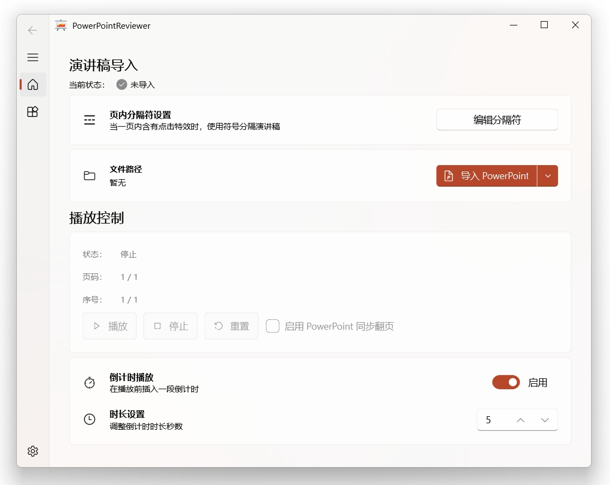

<div align="center">
<!-- Title: -->
  <h1>PowerPointReviewer</h1>
<!-- Short description: -->
  <p>一个 PowerPoint 讲稿朗读审阅工具</p>
</div>



## 项目简介

一个基于PySide6实现的演讲稿朗读审阅工具，使用TTS引擎朗读PPT中的备注部分，从而辅助您进一步完善演讲的内容与措辞，助您顺利完成精彩的PPT演讲与展示。

## 基本特性

- 基于Python、PySide6、PySide6-Fluent-Widgets实现
- 支持从 PPT 备注导入演讲稿，也可从 Word / JSON 讲稿文件导入
- 支持编辑页内分隔符，用于在一页PPT中执行点击效果
- 支持朗读前插入并设置倒计时
- 支持PPT同步翻页功能
- 支持停止朗读后重新从当前语句开始朗读
- 支持页码跳转
- 支持统计演讲稿信息
- 支持讲稿往返编辑：导出为 Word 表格或 JSON，修改后可直接导回
- 支持导出 PPT备注、Markdown、SRT字幕、音频文件（逐条或合并）及工程包格式
- 支持多TTS引擎切换与参数独立保存
- 支持在线TTS引擎（Edge / 阿里百炼 / 千问复刻）
- 支持AI改写讲稿，兼容 OpenAI 格式
- 支持历史记录列表，支持会话恢复
- 支持音频缓存复用
- 支持检查更新

## TTS引擎说明

当前内置4种引擎：

- 本地 TTSx3：离线可用，稳定，适合无网场景
- 在线 Edge-TTS：配置简单，音色自然，支持切换语言地区
- 在线 阿里百炼：可配置模型/语速/音量/音调
- 在线 千问复刻：支持云端复刻音色合成


## 使用方法

1. 启动软件，根据您的讲稿文本，编辑分隔符。
2. 在设置页选择TTS引擎并调整参数，可随时试听。点击“保存设置”生效。
3. 在主页点击导入按钮，选择您的文件路径。之后，软件会将讲稿文本导入，并转换为语音文件，这可能需要一点时间。
4. 软件导入完毕后，即可使用播放控制功能。您可以选择播放、停止、重置音频，跳转播放页码，查看统计信息。
5. 如果启用倒计时播放功能，点击播放后，软件将先播放倒计时，再播放正文讲稿。
6. 如果启用PPT同步翻页功能，请在播放后保持焦点在PPT放映窗口中，软件将自动发送下一页指令。
7. 可在“历史记录列表”中快速加载过往会话。支持 Ctrl / Shift 多选与全选，可统一管理记录。
8. 可在实用工具页对已导入讲稿进行进一步处理。

## AI 优化

在实用工具页可进入AI 优化窗口，可点击窗口中的“接口配置”填写连接参数，目前支持 OpenAI 格式。填写后点击“测试连接”确认可用，即可开始改写。

## 格式规范

为了便于快速上手，本项目提供PPT模板和Word模板，在本项目的`example`目录下。

您可以使用本软件导入，快速预览效果，了解其实现方式。

## 进阶使用

在Windows系统中，本地TTS功能通过调用SAPI 5 text-to-speech (TTS) engine来实现，默认引擎均为微软的普通语音包，发音较为生硬。

推荐本地部署[NaturalVoiceSAPIAdapter](https://github.com/gexgd0419/NaturalVoiceSAPIAdapter)，能够为本软件提供微软自然语音的SAPI 5 TTS引擎。下载本地自然语音包后，启动相关功能即可，具体部署方法请参见该项目文档。

## 如何打包

本项目提供Windows可执行文件。如果您想从代码重新编译本项目，可参考以下指令。

使用pyinstaller：

```shell
pyinstaller PowerPointReviewer.spec
```

如果遇到任何bug，或者有任何建议，欢迎提交issue，谢谢。
