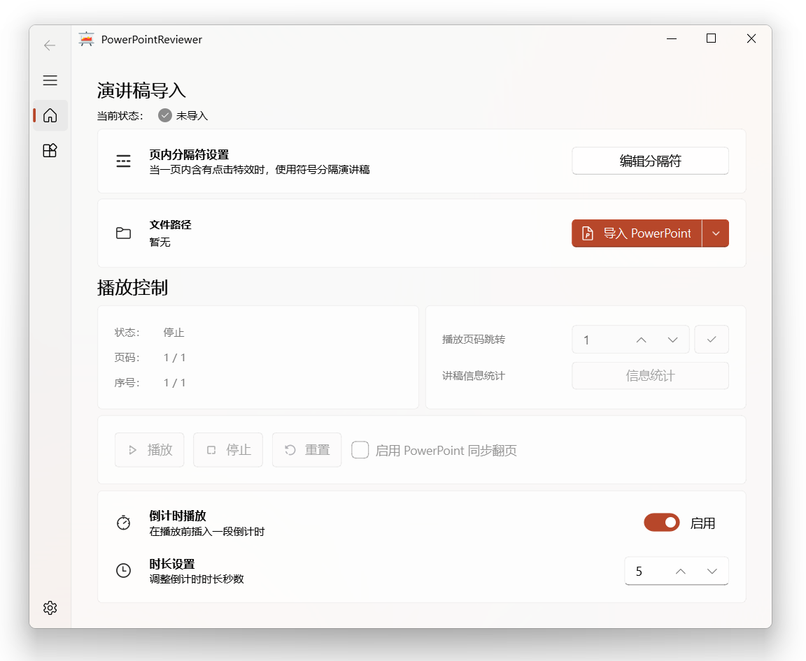

<p align="center">
</p>
  <h1 align="center">
  PowerPointReviewer
</h1>
<p align="center">
  一个 PowerPoint 讲稿朗读审阅工具
</p>



## 功能介绍

一个基于PySide6实现的演讲稿朗读审阅工具，使用TTS引擎朗读PPT中的备注部分，从而辅助您进一步完善演讲的内容与措辞，助您顺利完成精彩的PPT演讲与展示。

## 基本特性

- 基于Python、PySide6实现
- 支持从PPT备注和Word中导入演讲稿
- 支持编辑页内分隔符，用于在一页PPT中执行点击效果
- 支持朗读前插入并设置倒计时
- 支持PPT同步翻页功能
- 支持停止朗读后重新从当前语句开始朗读
- 支持页码跳转
- 支持统计演讲稿信息
- 支持演讲稿文本导出，包括：导出至PPT备注、导出至Word文档、导出至JSON文件
- 支持选择TTS发声引擎（目前来自系统TTS），支持设置发声速度、发声音量
- 支持检查更新

## 使用方法

1. 启动软件，根据您的讲稿文本，编辑分隔符。
2. 点击导入按钮（PPT或Word），选择您的文件路径。之后，软件会将讲稿文本导入，并转换为语音文件，这可能需要一点时间。
3. 软件导入完毕后，即可使用播放控制功能。您可以选择播放、停止、重置音频，跳转播放页码，查看统计信息。
4. 如果启用倒计时播放功能，点击播放后，软件将先根据设置播放指定长度的倒计时，之后播放讲稿。这一般与PPT同步翻页功能同时启用。
5. 如果启用PPT同步翻页功能，您需要在软件开始播放后，放映您的PPT，并保持焦点在PPT放映窗口中。软件将根据您的讲稿发送下一页指令，自动同步翻页。
6. 在实用工具页面，您可以将已导入的讲稿，自由转换为PPT备注、Word文档、JSON文件。
7. 在设置页面，您可以选择TTS发声引擎（在Windows下，默认只有一个中文发声引擎，您可以通过修改注册表的方式添加部分其他已有引擎），设置发声速度、发声音量。在设置完毕后，需要手动保存。

## 格式规范

为了便于快速上手，本项目提供PPT模板和Word模板，在本项目的`example`目录下。

您可以使用本软件导入，快速预览效果，了解其实现方式。

## 如何打包

本项目提供Windows可执行文件。如果您想从代码重新编译本项目，您可以参考以下指令。

使用pyinstaller：

```python
pyinstaller -w -i .\image\ppt_ico.ico main.py -n PowerPointReviewer --add-data "venv\\Lib\\site-packages\\pptx\\templates\\*;.\\pptx\\templates"
```

## 更新日志

### 版本 1.0

- 2023.10.31-1.0.1：优化讲稿转换后的文件名；优化生成倒计时逻辑；优化导入完成后的文字表现；优化播放结束后的文字表现；新增播放跳转功能；新增播放统计功能。
- 2023.10.19-1.0.0：提交代码至代码托管平台。

如果遇到任何bug，或者有任何建议，欢迎提交issue，谢谢。
